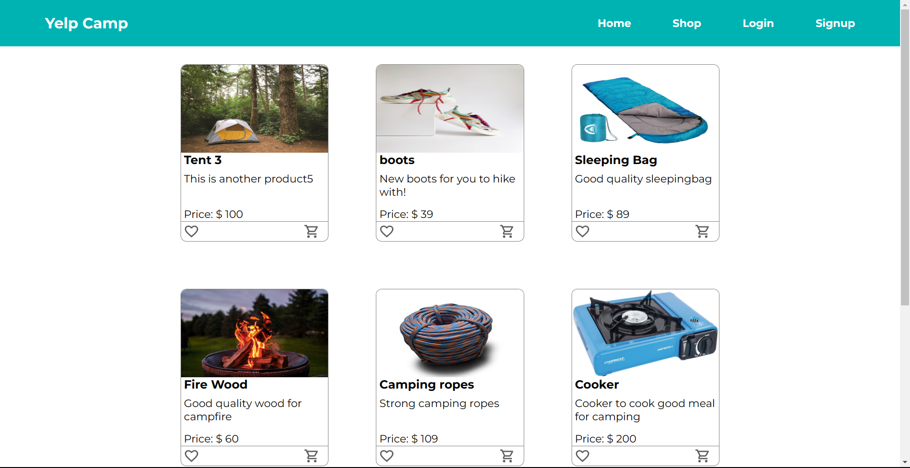

# Aman Gupta

**`Tech enthusiast (Web Development/Freelancing/Robotics)`**

I'm a Freelance Full Stack Web developer. Over the past half a year, I have helped my clients develop websites for their business from scratch which helped them get an online presence and have helped them solve real life problems through coding and web development. I have been doing web development from past one year and have almost One year of experience and I also love robotics and I have built a few projects using microcontrollers.

---
### Languages and Tools

 
#

### Some of my Work

  

### Stats

#

  
<h3>My Coding Journey</h3>

    

